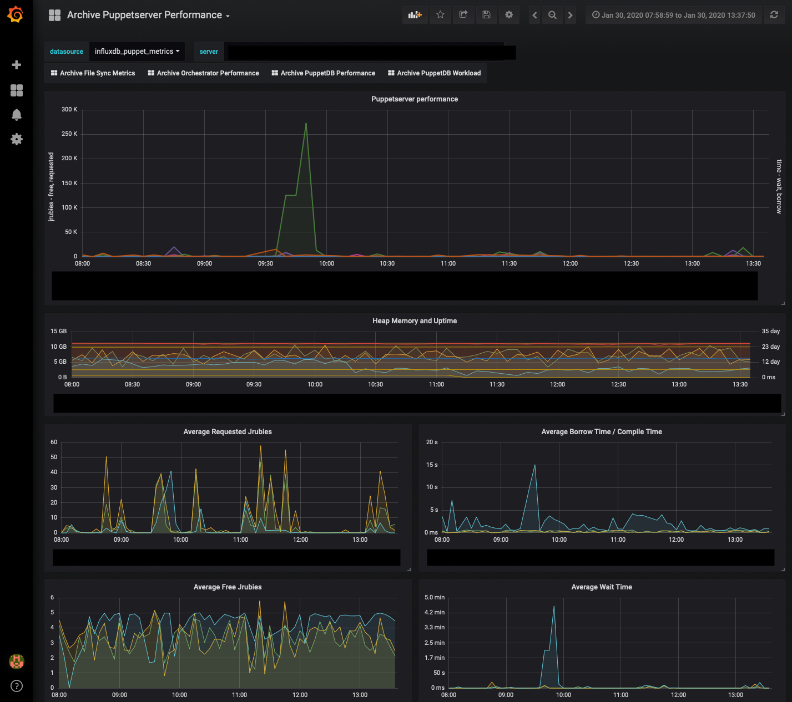

# puppet-metrics-viewer

This repo contains a CLI tool for generating visualizations of your puppet
metrics data.  It assumes you have collected the metrics using  [npwalker/pe_metric_curl_cron_jobs](https://github.com/npwalker/pe_metric_curl_cron_jobs).

## View metrics in Grafana



 The `json2graphite.rb` script can be used to transform data in JSON files into a format that can be fed into Graphite.

To run this code, you will need [Docker](https://www.docker.com/products/overview) (and docker-compose) installed.  _Tip:_ If you're using a Mac, use the official Mac packages instead of installing from brew.  (If you figure out how to use this with docker installed from brew let us know)

With Docker installed, you can run the script `view-in-grafana.sh`, passing it the directory containing the data files to load into Graphite. e.g.

```
./view-in-grafana.sh ~/Downloads/pe_metrics/puppet_server
```

You can then view the metrics by visting `http://localhost:3000` in your browser.
 - username: `admin`
 - password: `admin`.

### Export data to pre-existing Graphite or InfluxDB

The `json2graphite.rb` script can be used to transform data in the JSON files into a format that can be fed into any Graphite or InfluxDB instance.

Usage:

```
./json2graphite.rb [--pattern PATTERN] [filename_1 ... filename_n]
```

Output will be lines in Graphite's plain text input format. The output can be sent to a host running graphite by passing a hostname to the `--netcat` flag.

Examples:

```
./json2graphite.rb ~/Downloads/logdump/puppetserver/*.json --netcat localhost
```

The `--netcat` flag will send output to port 2003. A custom port can be used by piping stdout to `nc` instead:

```
./json2graphite.rb ~/Downloads/logdump/puppetserver/*.json | nc localhost 4242
```

The simple example can be used for small numbers of files. When more files exist than can be referenced as arguments, use `--pattern`.

```
./json2graphite.rb --pattern '~/Downloads/logdump/puppetserver/*.json' --netcat localhost
```

The `--pattern` flag accepts a Ruby glob argument, which Ruby will then expand into a list of files to process.

InfluxDB output can be produced using the `--convert-to` flag:

```
./json2graphite.rb ~/Downloads/logdump/puppetserver/*.json --convert-to influxdb
```

When `--netcat` is used with InfluxDB output, data will be sent to port 8086. The `--influx-db` flag must also be used to specify a database to write to:

```
./json2graphite.rb ~/Downloads/logdump/puppetserver/*.json --convert-to influxdb --netcat localhost --influx-db pe-metrics
```
