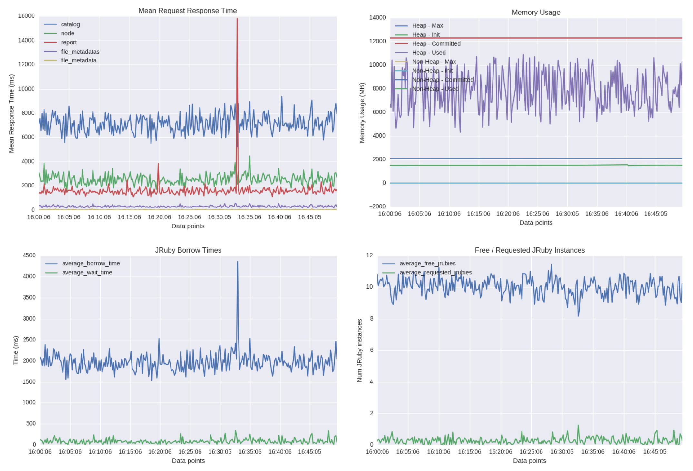

# puppetserver-metrics-viz

This repo contains some CLI tools for generating visualizations of puppetserver
metrics data.  It assumes that you have collected one or more JSON payloads
from the PE Puppet Server status endpoint and saved them to disk.

Two tools are provided.

2. Docker/Ruby tooling to run Grafana with the data loaded
1. Python CLI tools to generate static HTML pages with graphs to view

## Method 1: View metrics in Grafana


For large datasets collected from customers in the form of JSON files, it may be desirable to export the data to graphite. The `json2graphite.rb` script can be used to transform data in the JSON files into a format that can be fed into Graphite.

To run this code, you will need [Docker](https://www.docker.com/products/overview) (and docker-compose) installed.

With Docker installed, you can run the script `view-in-grafana.sh`, passing it the directory containing the data files to load into Graphite. e.g.

    ./view-in-grafana.sh ~/Downloads/pe_metrics/puppet_server

You can then view the metrics by visting `http://localhost:3000` in your browser. Username: `admin`, password: `admin`.

### Export data to pre-existing Graphite

The `json2graphite.rb` script can be used to transform data in the JSON files into a format that can be fed into any Graphite instance.

Usage:

    ./json2graphite.rb [--pattern PATTERN] [filename_1 ... filename_n]

Output will be lines in Graphite's plain text input format. This output can be fed through a tool like `nc` to inject it into Graphite.

Examples:

    ./json2graphite.rb ~/Downloads/logdump/puppetserver/*.json | nc localhost 2003

The simple example can be used for small numbers of files. When more files exist than can be referenced as arguments, use `--pattern`.

    ./json2graphite.rb --pattern '~/Downloads/logdump/puppetserver/*.json' | nc localhost 2003

The `--pattern` flag accepts a Ruby glob argument, which Ruby will then expand into a list of files to process.

## Method 2: Static HTML Pages



The current implementation supports visualizing data produced by Nick Walker's
puppet module / cron job, where there are periodic HTTP requests made to the
status endpoint and each result is saved to a unique file with a predictable
naming convention.  The code is organized such that it should be easy to add
another CLI tool that will allow you to generate the same visualizations based
on data produced via the `debug-logging` setting in tk-status (see
[TK-400](https://tickets.puppetlabs.com/browse/TK-400 for more info), which
takes the approach of appending each HTTP response to a single file rather
than splitting over multiple files.

To run this code, you will need the following python-related distro packages:

```
python-tk
python-setuptools
python-wheel
```

Then you will need to install the following python libraries:

```
pip install seaborn numpy matplotlib
```

After that, you can run the script `multiple_dumps_multiple_files.py`, passing
it the prefix of the series of files you want it to generate visualizations
for.  e.g.:

```
python ./multiple_dumps_multiple_files.py --file-prefix ./target/pe_metrics/puppet_server/my.host.name-11_18_16
```

The results are currently written to the `./target` directory - open up
`report.html` in your browser.

### Metrics from older PE installations

Some older installations of PE (e.g. 3.8) do not log data expected by the visualizer scripts. As a work-around, you can run the included `patch_files.rb` script to create versions of the json files with injected dummy data, so that they can be processed and visualized anyway.

Usage:

    ./patch_files.rb [filename_1 ... filename_n]

Examples:

    ./patch_files.rb ~/Downloads/logdump/puppet_server/*.json

The tool will create new files alongside the originals with the prefix "patched."


## TODO LIST

* use different output dirs / filenames based on the input so you don't blow away
  your previous results when you run the tool
* Add some output indicating where the files were written
* Add support for additional Puppet Server metrics
* Add support for other service's metrics (e.g. PuppetDB)
